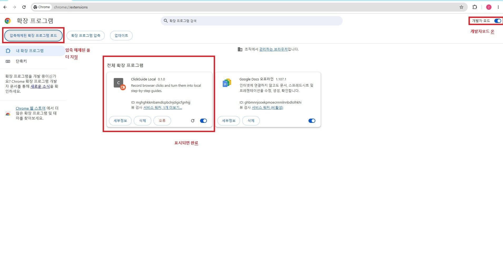
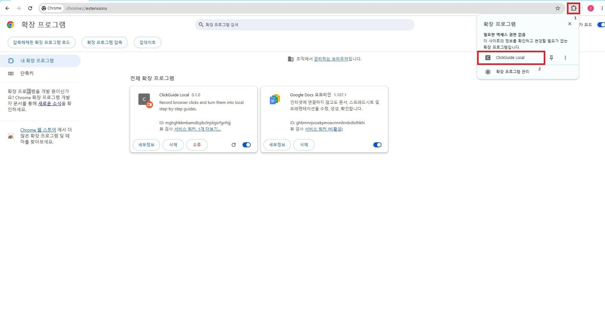
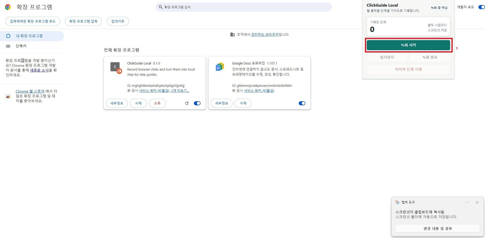
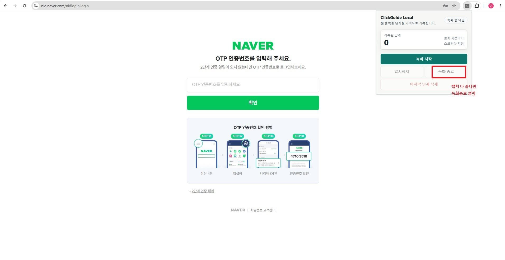
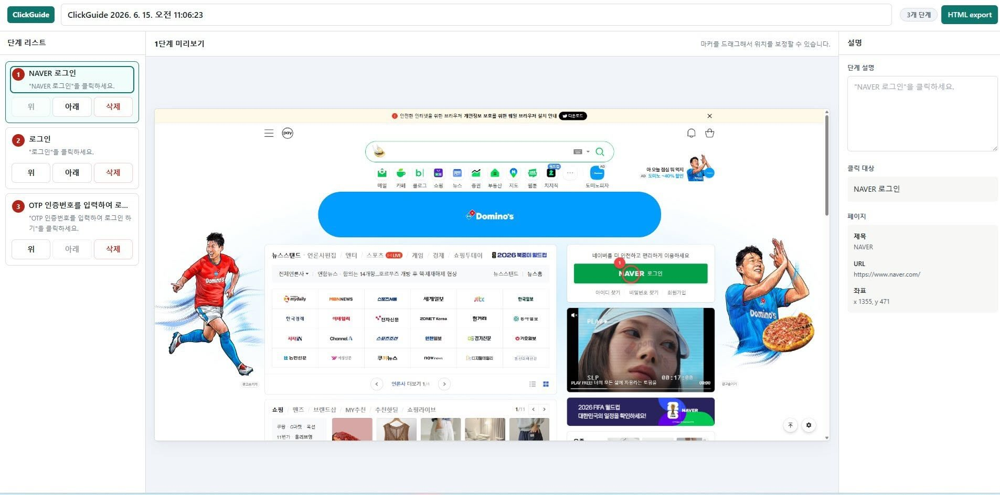

# ClickGuide Local

ClickGuide Local은 웹사이트에서 클릭한 과정을 자동으로 기록하고, 스크린샷이 들어간 단계별 PDF 가이드를 만들어 주는 Chrome 확장 프로그램입니다.

개발 지식이 없어도 설치할 수 있도록 설치 파일과 설명 PPT를 GitHub Release에 올려두었습니다.

## 먼저 받을 파일

아래 링크에서 최신 설치 파일을 받으세요.

- [최신 설치 파일 받기](https://github.com/koul777/clickguide-local-private/releases/latest)
- 바로 다운로드: [ClickGuideLocal_team_package_v0.1.1_easy.zip](https://github.com/koul777/clickguide-local-private/releases/download/v0.1.1/ClickGuideLocal_team_package_v0.1.1_easy.zip)
- 설명 PPT만 따로 보기: [ClickGuideLocal_install_guide_KO.pptx](https://github.com/koul777/clickguide-local-private/releases/download/v0.1.1/ClickGuideLocal_install_guide_KO.pptx)

설명 PPT는 설치 zip 파일 안에도 들어 있습니다.

```text
ClickGuideLocal_team_package_v0.1.1_easy.zip
└─ ClickGuideLocal_팀설치_실행가이드.pptx
```

주의: GitHub의 초록색 `Code` 버튼에서 받는 ZIP은 개발자용 소스 코드입니다. 일반 사용자는 위의 `ClickGuideLocal_team_package_v0.1.1_easy.zip` 파일을 받으세요.

## 설치 방법

### 1. 설치 파일 압축 풀기

다운로드한 `ClickGuideLocal_team_package_v0.1.1_easy.zip` 파일을 압축 해제합니다.

압축을 풀면 아래 폴더가 보입니다.

```text
LOAD_THIS_FOLDER_ClickGuideLocal
```

Chrome에서 반드시 이 폴더를 선택해야 합니다.

### 2. Chrome 확장 프로그램 화면 열기

Chrome 주소창에 아래 주소를 입력합니다.

```text
chrome://extensions
```

오른쪽 위 `개발자 모드`를 켜고, 왼쪽 위 `압축해제된 확장 프로그램 로드` 버튼을 누릅니다.



### 3. 설치 폴더 선택하기

폴더 선택 창이 열리면 아래 폴더를 선택합니다.

```text
LOAD_THIS_FOLDER_ClickGuideLocal
```

잘못 선택하면 설치가 되지 않습니다.

선택하면 안 되는 것:

```text
ClickGuideLocal_team_package_v0.1.1_easy
ClickGuideLocal-extension-*.zip
assets
```

선택해야 하는 것:

```text
LOAD_THIS_FOLDER_ClickGuideLocal
```

### 4. 확장 프로그램 고정하기

Chrome 오른쪽 위 퍼즐 모양 아이콘을 누르고 `ClickGuide Local`을 고정합니다.



여기까지 하면 설치가 끝난 것입니다.

## 사용 방법

### 1. 녹화 시작

문서화할 웹사이트를 연 뒤, 오른쪽 위 `ClickGuide Local` 아이콘을 클릭합니다.

팝업에서 `녹화 시작`을 누릅니다.



### 2. 평소처럼 클릭하기

업무를 평소처럼 진행합니다. 클릭할 때마다 화면이 스크린샷으로 저장되고, 클릭 위치에 빨간 번호 마커가 들어갑니다.

### 3. 녹화 종료

필요한 화면을 모두 클릭했으면 `ClickGuide Local` 팝업을 다시 열고 `녹화 종료`를 누릅니다.



### 4. 가이드 확인 및 PDF 저장

녹화를 종료하면 편집 화면이 자동으로 열립니다.

여기서 할 수 있는 일:

- 가이드 제목 수정
- 단계 제목 수정
- 단계 설명 수정
- 단계 순서 변경
- 필요 없는 단계 삭제
- 빨간 마커 위치 보정
- PDF 파일 저장



참고: 위 화면은 예시 이미지입니다. 최신 버전에서는 오른쪽 위 내보내기 버튼이 `PDF 저장`으로 표시됩니다.

## 업데이트 방법

새 버전을 받았을 때는 아래 순서로 업데이트합니다.

1. 새 `ClickGuideLocal_team_package_*.zip` 파일을 다운로드합니다.
2. 압축을 풉니다.
3. 기존 폴더 대신 새 `LOAD_THIS_FOLDER_ClickGuideLocal` 폴더를 둡니다.
4. Chrome에서 `chrome://extensions`를 엽니다.
5. `ClickGuide Local` 카드의 새로고침 버튼을 누릅니다.

## 자주 나는 문제

### "매니페스트 파일이 없거나 읽을 수 없습니다"라고 나옵니다

잘못된 폴더를 선택한 것입니다.

Chrome에서 선택해야 하는 폴더는 반드시 아래 폴더입니다.

```text
LOAD_THIS_FOLDER_ClickGuideLocal
```

이 폴더 안에 `manifest.json` 파일이 바로 보여야 정상입니다.

### 확장 프로그램 아이콘이 안 보입니다

Chrome 오른쪽 위 퍼즐 모양 아이콘을 누른 뒤 `ClickGuide Local` 옆의 고정 버튼을 누르세요.

### `chrome://` 화면이나 Chrome 설정 화면은 녹화가 안 됩니다

Chrome이 보안상 막는 페이지는 확장 프로그램이 기록할 수 없습니다. 일반 웹사이트나 업무 시스템 화면에서 사용하세요.

## 개인정보 안내

ClickGuide Local은 사용자가 직접 `녹화 시작`을 누른 동안만 클릭과 스크린샷을 기록합니다.

저장되는 정보:

- 클릭한 위치
- 현재 페이지 제목
- 현재 페이지 URL
- 클릭 대상 텍스트
- 클릭 시점의 스크린샷

저장 위치:

- 사용자의 Chrome 브라우저 내부 저장소인 IndexedDB

이 프로그램은 기록한 내용을 외부 서버로 보내지 않습니다. 다만 PDF 가이드에는 스크린샷과 URL이 포함될 수 있으므로, 비밀번호나 민감한 개인정보가 보이는 화면은 녹화하지 않는 것이 좋습니다.

## 주요 기능

- 클릭 흐름 자동 기록
- 클릭 시점 스크린샷 저장
- 단계별 설명 편집
- 단계 순서 변경
- 불필요한 단계 삭제
- 클릭 마커 위치 보정
- PDF 가이드 저장
- 비밀번호 입력란 기록 제외
- `data-clickguide-ignore`가 지정된 요소 기록 제외

## 개발자용 안내

소스 코드로 직접 빌드하려면 Node.js 20 이상과 npm 10 이상이 필요합니다.

```powershell
npm.cmd install
npm.cmd run build
```

macOS 또는 Linux에서는 아래 명령을 사용하세요.

```bash
npm install
npm run build
```

빌드 후 생성되는 `dist` 폴더를 Chrome 확장 프로그램 화면에서 로드하면 됩니다.

## 저장소 구조

```text
public/manifest.json              Chrome 확장 프로그램 매니페스트
src/background/service-worker.ts   백그라운드 워커와 스크린샷 캡처 처리
src/content/recorder.ts            클릭 이벤트 기록 스크립트
src/popup/main.tsx                 녹화 제어 팝업 UI
src/editor/main.tsx                가이드 편집 UI
src/shared/db.ts                   IndexedDB 저장소 처리
src/shared/exportPdf.ts            PDF 생성
src/shared/markerCanvas.ts         스크린샷 마커 그리기
src/shared/stepText.ts             단계 제목과 기본 안내 문구 처리
scripts/make_clickguide_ppt.py     설치 안내 PPT 생성 스크립트
docs/images/                       README에 사용하는 설치/사용 스크린샷
```

## 라이선스

MIT
