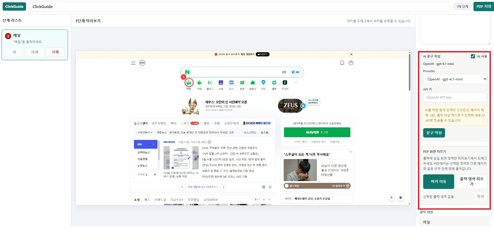

# ClickGuide Local

ClickGuide Local은 웹사이트에서 클릭한 과정을 자동으로 기록하고, 스크린샷이 들어간 단계별 PDF 가이드를 만들어 주는 Chrome 확장 프로그램입니다.

이 README만 보고 설치할 수 있도록 설명했습니다. 개발 지식은 필요하지 않습니다.

## 설치 파일 받기

아래 파일 하나만 받으면 됩니다.

- [ClickGuideLocal.zip 다운로드](https://github.com/koul777/clickguide-local-private/releases/download/v0.1.1/ClickGuideLocal.zip)
- [최신 릴리스 페이지 보기](https://github.com/koul777/clickguide-local-private/releases/latest)

주의: GitHub의 초록색 `Code` 버튼에서 받는 ZIP은 개발자용 소스 코드입니다. 일반 사용자는 반드시 위의 `ClickGuideLocal.zip` 파일을 받으세요.

## 설치 방법

### 1. `ClickGuideLocal.zip` 압축 풀기

다운로드한 `ClickGuideLocal.zip` 파일을 압축 해제합니다.

압축을 푼 폴더 안에 아래 파일들이 바로 보여야 정상입니다.

```text
manifest.json
popup.html
guide-editor.html
assets
```

중요: Chrome에서 선택할 폴더는 `manifest.json` 파일이 바로 보이는 폴더입니다.

### 2. Chrome 확장 프로그램 화면 열기

Chrome 주소창에 아래 주소를 입력합니다.

```text
chrome://extensions
```

오른쪽 위 `개발자 모드`를 켭니다.

그다음 왼쪽 위 `압축해제된 확장 프로그램 로드` 버튼을 누릅니다.


### 3. 압축 푼 폴더 선택하기

폴더 선택 창이 열리면 `ClickGuideLocal.zip`을 압축 해제한 폴더를 선택합니다.

선택해야 하는 폴더:

```text
manifest.json이 바로 들어 있는 폴더
```

선택하면 안 되는 것:

```text
ClickGuideLocal.zip 파일 자체
assets 폴더
manifest.json의 상위 폴더
```

설치가 정상적으로 되면 Chrome 확장 프로그램 목록에 `ClickGuide Local`이 표시됩니다.

### 4. 확장 프로그램 고정하기

Chrome 오른쪽 위 퍼즐 모양 아이콘을 누릅니다.

`ClickGuide Local` 옆의 고정 버튼을 눌러 아이콘을 항상 보이게 합니다.


여기까지 하면 설치가 끝났습니다.

## 사용 방법

### 1. 녹화 시작

문서화할 웹사이트를 엽니다.

오른쪽 위 `ClickGuide Local` 아이콘을 클릭한 뒤 `녹화 시작`을 누릅니다.


### 2. 평소처럼 클릭하기

업무를 평소처럼 진행합니다.

클릭할 때마다 화면이 스크린샷으로 저장되고, 클릭 위치에 빨간 번호 마커가 들어갑니다.

### 3. 녹화 종료

필요한 클릭을 모두 기록했으면 `ClickGuide Local` 팝업을 다시 열고 `녹화 종료`를 누릅니다.


### 4. 가이드 확인 및 PDF 저장

녹화를 종료하면 편집 화면이 자동으로 열립니다.

편집 화면에서 할 수 있는 일:

- 가이드 제목 수정
- 단계 제목 수정
- 단계 설명 수정
- 단계 순서 변경
- 필요 없는 단계 삭제
- 빨간 마커 위치 보정
- PDF에 넣을 화면 영역만 드래그해서 자르기
- 현재 가이드 또는 모든 로컬 기록 삭제
- AI 문구 작성 사용 여부 선택
- PDF 파일 저장

아래 화면처럼 오른쪽 패널에서 AI 문구 작성과 PDF 화면 자르기 영역을 사용할 수 있습니다.



참고: 위 화면은 예시 이미지입니다. 최신 버전에서는 오른쪽 위 버튼이 `PDF 저장`으로 표시됩니다.

## 업데이트 방법

새 버전이 나오면 아래 순서로 업데이트합니다.

1. 새 `ClickGuideLocal.zip` 파일을 다운로드합니다.
2. 기존 폴더를 지우거나 다른 이름으로 바꿉니다.
3. 새 `ClickGuideLocal.zip`을 압축 해제합니다.
4. Chrome에서 `chrome://extensions`를 엽니다.
5. `ClickGuide Local` 카드의 새로고침 버튼을 누릅니다.

## 추가 업데이트 내용

2026년 7월 1일 ERP 호환성과 AI 사용 설정을 보강했습니다.

- 영림원 ERP처럼 iframe 안에서 아이콘형 버튼을 쓰는 화면의 클릭 기록을 보강했습니다.
- ERP가 화면 전환 중 `about:blank`, sandbox, 동적 iframe을 만들더라도 recorder가 들어가도록 `content_scripts`, `all_frames`, `match_about_blank` 설정을 다시 적용했습니다.
- iframe 내부 클릭 메시지가 `null` origin으로 들어오는 ERP 화면도 실제 하위 frame에서 온 메시지이면 기록할 수 있게 처리했습니다.
- 녹화 중 새로 로드되는 frame에도 recorder 상태가 전달되도록 `webNavigation` 기반 재주입을 보강했습니다.
- AI 문구 작성 기능은 `VITE_ALLOW_EXTERNAL_AI=true`로 빌드한 배포본에서 사용할 수 있습니다. `AI 사용`을 켜면 보안 확인창이 먼저 뜨고, 확인 후 OpenAI, Gemini, Claude API 키를 입력해 문구를 작성할 수 있습니다.
- AI API 키는 브라우저 저장소에 저장하지 않고 현재 편집 화면의 메모리 상태에만 보관됩니다.

## 자주 나는 문제

### "매니페스트 파일이 없거나 읽을 수 없습니다"라고 나옵니다

잘못된 폴더를 선택한 것입니다.

Chrome에서 선택한 폴더 안에 `manifest.json` 파일이 바로 있어야 합니다.

정상 구조:

```text
선택한 폴더
├─ manifest.json
├─ popup.html
├─ guide-editor.html
└─ assets
```

### 확장 프로그램 아이콘이 안 보입니다

Chrome 오른쪽 위 퍼즐 모양 아이콘을 누른 뒤 `ClickGuide Local` 옆의 고정 버튼을 누르세요.

### `chrome://` 화면이나 Chrome 설정 화면은 녹화가 안 됩니다

Chrome이 보안상 막는 페이지는 확장 프로그램이 기록할 수 없습니다. 일반 웹사이트나 업무 시스템 화면에서 사용하세요.

### Excel이나 설치형 프로그램 화면도 자동 기록할 수 있나요?

현재 버전은 Chrome 확장 프로그램이므로 Chrome 탭 안의 웹 화면만 자동 기록할 수 있습니다.

Excel, 한글, 설치형 ERP, Windows 프로그램 화면은 Chrome 확장 프로그램 권한 밖이라 클릭 감지와 자동 캡처가 되지 않습니다. 이런 화면까지 자동 기록하려면 별도의 Windows 데스크톱 캡처 프로그램이나 로컬 보조 프로그램이 필요합니다.

### 영림원 ERP 같은 화면의 아이콘 버튼이 기록되지 않습니다

최신 버전은 이미지형 버튼, 아이콘형 버튼, iframe 안의 ERP 버튼 기록을 보강했습니다.

확장 프로그램 권한이 바뀐 경우 Chrome 확장 프로그램 화면에서 단순 새로고침보다 기존 확장을 제거한 뒤 새 ZIP을 다시 로드하는 쪽이 확실합니다.

## 개인정보 안내

ClickGuide Local은 사용자가 직접 `녹화 시작`을 누른 동안만 클릭과 스크린샷을 기록합니다.

저장되는 정보:

- 클릭한 위치
- 현재 페이지 제목
- 현재 페이지 URL
- 클릭 대상 텍스트
- 클릭 시점의 스크린샷

저장 위치:

- 사용자의 Chrome 브라우저 내부 저장소인 IndexedDB

기본 배포에서는 이 프로그램이 기록한 내용을 외부 서버로 보내지 않습니다. 다만 AI 문구 작성 기능을 별도로 허용하고 사용자가 직접 켜면 현재 단계의 스크린샷, URL, 페이지 제목, 클릭 대상 텍스트가 선택한 외부 AI API로 전송될 수 있습니다.

PDF 가이드에는 스크린샷과 URL이 포함될 수 있으므로, 비밀번호나 민감한 개인정보가 보이는 화면은 녹화하지 않는 것이 좋습니다.

## 회사 내부 배포 보안 안내

ClickGuide Local은 회사 내부 로컬 사용을 기준으로 기본 보안 설정을 낮은 위험 방향으로 맞춥니다.

- 기본 동작은 로컬 저장입니다. 캡처된 스크린샷과 가이드 데이터는 사용자의 Chrome IndexedDB에 저장됩니다.
- 캡처 데이터는 브라우저에 남을 수 있으므로 편집 화면의 `현재 가이드 삭제` 또는 `모든 로컬 기록 삭제` 버튼으로 주기적으로 삭제하세요.
- 사내 배포 기본값으로는 AI 기능을 끄는 것을 권장합니다. 빌드 시 `VITE_ALLOW_EXTERNAL_AI=false` 또는 환경변수 미설정 상태를 사용하세요.
- AI 기능을 허용하고 사용자가 `AI 사용`을 켜면 보안 확인창이 먼저 표시됩니다. 회사 보안 정책에 위배될 수 있거나 개인정보, 고객정보, 영업비밀, 내부 시스템 정보가 포함된 화면이라면 AI 연결/API 키 입력/문구 작성을 진행하지 마세요.
- AI 사용을 확인하면 스크린샷, URL, 페이지 제목, 클릭 대상 텍스트가 외부 AI API로 전송될 수 있습니다. API 키는 브라우저 저장소에 저장하지 않고 현재 화면의 메모리 상태에만 보관됩니다.
- ERP iframe 호환성을 위해 recorder는 `content_scripts`로 HTTP/HTTPS 화면과 하위 frame에 미리 주입될 수 있습니다. 실제 클릭과 스크린샷 저장은 사용자가 `녹화 시작`을 누른 동안에만 실행됩니다.
- 엄격한 사내 도메인 고정 배포가 필요하면 필요한 도메인만 `host_permissions`와 `content_scripts[].matches`에 명시적으로 추가하세요.
- ERP 호환성을 위해 iframe 안의 아이콘형 버튼도 기록할 수 있게 보강했습니다. 동적/sandbox iframe에서 `null` origin 메시지가 들어오는 경우에도 실제 하위 frame에서 온 메시지인지 확인한 뒤 처리합니다.
- 편집 화면 진입과 확장 리소스 로딩을 위해 `guide-editor.html`은 web accessible resource로 포함될 수 있습니다.
- 개발 서버를 외부 네트워크에 공개하지 마세요. 특히 `npm run dev -- --host 0.0.0.0` 형태로 실행하지 마세요.
- 사내 배포에는 개발 서버가 아니라 `npm run build`로 생성한 `dist` 결과물만 사용하세요.

민감정보가 포함된 화면에서는 아래 attribute를 업무 시스템 HTML에 적용할 수 있습니다.

```html
<div data-clickguide-redact>민감정보</div>
<button data-clickguide-ignore>기록 제외 버튼</button>
```

- `data-clickguide-ignore`가 지정된 요소 또는 그 하위 요소를 클릭하면 단계 기록을 만들지 않습니다.
- `data-clickguide-redact`가 지정된 요소는 클릭 대상 텍스트 수집에서 제외되고, 스크린샷 캡처 동안 임시 마스킹 스타일이 적용됩니다.
- `input[type="password"]`는 클릭 대상 텍스트를 수집하지 않고, 스크린샷 캡처 동안 임시 마스킹 스타일이 적용됩니다.

AI 비활성 빌드 예시:

```powershell
$env:VITE_ALLOW_EXTERNAL_AI="false"
npm.cmd run build
```

macOS 또는 Linux:

```bash
VITE_ALLOW_EXTERNAL_AI=false npm run build
```

사용하는 Windows shell에 따라 환경변수 설정 문법이 다를 수 있습니다.

## 주요 기능

- 클릭 흐름 자동 기록
- 클릭 시점 스크린샷 저장
- 단계별 설명 편집
- 단계 순서 변경
- 불필요한 단계 삭제
- 클릭 마커 위치 보정
- PDF 출력 영역 자르기
- ERP iframe/아이콘형 버튼 기록 보강
- AI 사용 전 보안 확인창
- 현재 가이드 삭제 및 모든 로컬 기록 삭제
- PDF 가이드 저장
- 비밀번호 입력란 기록 제외
- `data-clickguide-ignore`가 지정된 요소 기록 제외
- `data-clickguide-redact`가 지정된 요소 마스킹

## 개발자용 안내

소스 코드로 직접 빌드하려면 Node.js 20 이상과 npm 10 이상이 필요합니다.

```powershell
npm.cmd install
npm.cmd run build
```

AI 기능을 명시적으로 허용해야 하는 내부 테스트 빌드는 아래처럼 실행합니다.

```powershell
$env:VITE_ALLOW_EXTERNAL_AI="true"
npm.cmd run build
```

AI를 허용하지 않는 회사 내부 배포에서는 환경변수를 설정하지 않거나 `false`로 설정하세요.

macOS 또는 Linux에서는 아래 명령을 사용하세요.

```bash
npm install
npm run build
```

빌드 후 생성되는 `dist` 폴더를 Chrome 확장 프로그램 화면에서 로드하면 됩니다.

## 저장소 구조

```text
public/manifest.json              Chrome 확장 프로그램 매니페스트
src/background/service-worker.ts   백그라운드 워커와 스크린샷 캡처 처리
src/content/recorder.ts            클릭 이벤트 기록 스크립트
src/popup/main.tsx                 녹화 제어 팝업 UI
src/editor/main.tsx                가이드 편집 UI
src/shared/db.ts                   IndexedDB 저장소 처리
src/shared/exportPdf.ts            PDF 생성
src/shared/markerCanvas.ts         스크린샷 마커 그리기
src/shared/stepText.ts             단계 제목과 기본 안내 문구 처리
docs/images/                       README에 사용하는 설치/사용 스크린샷
```

## 라이선스

MIT
